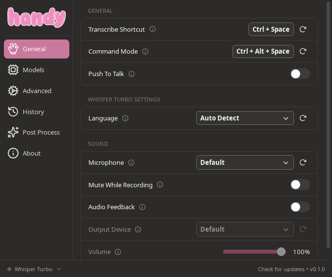
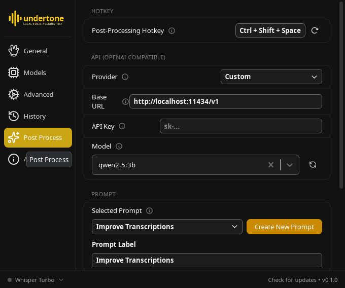

# Undertone

**Local-first voice dictation with an AI brain. Speak anywhere, get clean text — tone-matched to the app you're in. No cloud required.**

Undertone is an open-source alternative to cloud dictation tools like Wispr Flow. Press a hotkey, speak, and polished text lands wherever your cursor is — in any app. Transcription runs entirely on your machine (Whisper / Parakeet), and the optional AI cleanup layer runs against your own local LLM (Ollama, llama.cpp, LM Studio) or any OpenAI-compatible endpoint you choose.

<p align="center">
  
  
</p>

Undertone is a fork of the excellent [Handy](https://github.com/cjpais/Handy) by CJ Pais, extended with the "smart" layer cloud dictation apps charge for:

- **AI cleanup** — filler words removed, punctuation fixed, numbers formatted, using a local LLM. Fully optional: without a configured LLM you get raw Whisper output.
- **Tones** — Undertone detects the active application and adjusts the style hint sent to the LLM: casual for Slack/Discord, professional for email. Configurable app-pattern → style rules.
- **Command Mode** — select text anywhere, press the command hotkey, and speak an instruction ("make this more concise", "rewrite as a bullet list"). The selection is replaced with the edited text.
- **Wake word** — fully hands-free: say a configurable wake word (default "undertone") to start dictating, pause for a couple of seconds to stop. No hotkey needed.
- **Voice web search** — press the web search hotkey (default `Ctrl+Alt+G`), say your query, and it opens in your browser as a Google search.
- **System commands** — press the system command hotkey (default `Ctrl+Alt+Y`) and say "open firefox", "lock the screen", "sleep", "shut down the computer", or "restart". Deterministic keyword matching (never an LLM) so a mis-transcription can't reboot your machine; unrecognized speech is pasted as normal dictation.
- Everything Handy already does: fully offline transcription (Whisper Small→Large, Parakeet V3, GPU-accelerated), push-to-talk or toggle, VAD silence filtering, custom vocabulary, transcription history, tray app — on Windows and Linux (macOS inherited from Handy, untested here).

## Privacy

- Audio never leaves your machine.
- The LLM layer is opt-in and points wherever you configure — the default "Custom" provider targets `http://localhost:11434/v1` (Ollama).
- No telemetry, no accounts, no word quotas.

## Quick start

1. Grab a build from the [releases page](https://github.com/d4vid87/undertone/releases) (`.deb`/`.rpm`/AppImage for Linux, NSIS installer for Windows).
2. Launch, pick a transcription model in onboarding (Whisper Turbo recommended with a GPU).
3. Dictate: press the transcribe hotkey (default `Ctrl+Space`), speak, press it again to stop. Prefer hold-to-record? Enable "Push To Talk" in settings.

### Enable the AI layer (optional, recommended)

```bash
# install Ollama and a small fast model
curl -fsSL https://ollama.com/install.sh | sh
ollama pull qwen2.5:3b
```

Then in Undertone settings → Post-Processing: enable it, choose the **Custom** provider (already pointing at Ollama), select `qwen2.5:3b`, and dictate with the post-process hotkey (default `Ctrl+Shift+Space`).

- **Tones** are on by default (Slack/Discord → casual, Thunderbird → professional). Edit the rules in settings storage; a settings UI is on the roadmap.
- **Command Mode**: select text, press `Ctrl+Alt+Space`, speak an instruction, press again.
- **Wake word**: enable it in General settings and set your phrase — dictation starts when you say it and stops after ~2 s of silence.

## Platform notes

- **Linux**: X11 and Wayland. On KDE Wayland, install `ydotool` or `dotool` for the most reliable text injection; tones use `kdotool` when present.
- **Windows**: builds are CI-produced and community-tested — beta. Tones are not yet wired on Windows.
- **Android**: on the roadmap as a separate voice-keyboard (IME) app. Not part of this codebase.

## Building from source

Same as Handy — see [BUILD.md](BUILD.md). Short version: Rust + Bun, `bun install`, download the VAD model per BUILD.md, then `bun run tauri build`.

## License & credit

MIT. Undertone stands on [Handy](https://github.com/cjpais/Handy) (© CJ Pais and contributors) — transcription engine, UI, and cross-platform plumbing come from upstream. If you only need offline transcription without the LLM layer, use Handy and support it. The Whisper models are by OpenAI (MIT); Qwen 2.5 is Apache-2.0 by Alibaba.
